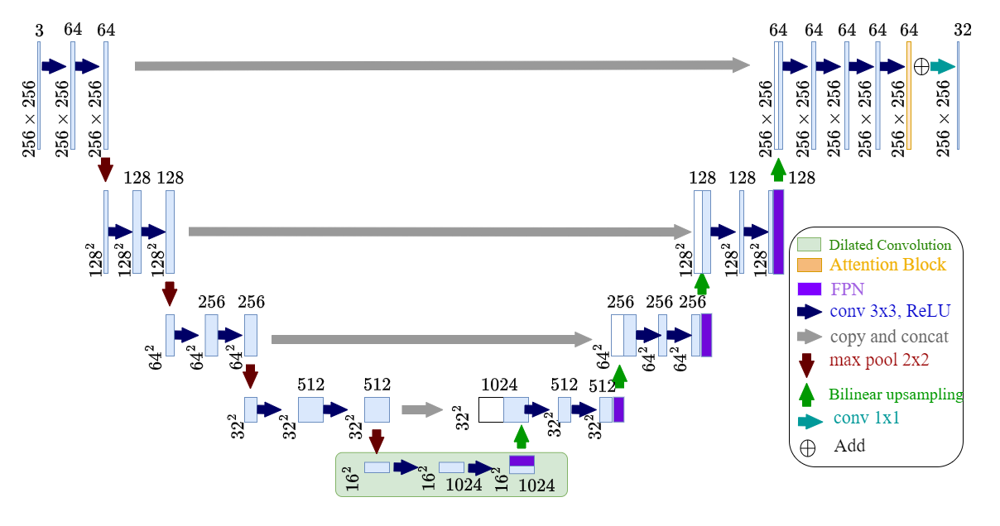

# SatStreaks: Towards Supervised Learning for Delineating Satellite Streaks from Astronomical Images (CRV 2024)


Delineation of satellite streaks in astronomical images is an important aspect of ground based space studies. While deep learning algorithms show promise, training and validation of deep learning models for satellite streak segmentation is challenging due to the limited availability of large-scale, annotated datasets. We introduce a dataset comprising of 3,130 densely annotated, real images of satellite streaks captured through ongoing citizen science projects. We utilize to develop a U-Net based model with FPN, Dilated Convolutions, Attention Mechanism & 1D convolution for the streak segmentation and conduct an experimental evaluation of data-driven image segmentation algorithms.

## 2. Data Source

## NASA Satellite Streak Watcher 
SatStreak leverages publicly available images from two projects: Satellite Streak Watcher citizen science project by and Asteroid Hunters. NASA Satellite Streak Watcher citizen science project consists of 233 ground-based images of the night sky containing satellite streaks. The dataset consists of a collection of images taken by participants, showcasing satellite streaks across various locations and timeframes. The project focuses on photographically tracking satellite streaks across the night sky, providing valuable insights into the extent of sky pollution caused by satellites. This dataset is part of a long-term project aimed at monitoring the population growth of satellites and studying their impact on ground-based astronomy. The images were captured under different lighting conditions, with varying exposures, cameras, and settings. Amateur skywatchers captured the images, so not all images were usable for this study. The images were selected based on several factors, including the signal’s complexity, the satellite trail’s size, and its visibility in the image. As a result of these constraints, 57 images were selected and used to generate hand annotated ground-truth masks to test the performance of our algorithm.

## [Asteroid Hunters Dataset (AHD)](https://www.zooniverse.org/projects/sandorkruk/hubble-asteroid-hunter)
The Asteroid Hunters dataset contains the largest collection of publicly available images of satellite streaks to date. The dataset contains 114,607 images taken by the Hubble Space Telescope (HST) over 19 years and was classified using online crowdsourcing to provide labels that describe the image contents. These images of size 4096X4096 pixels have been processed to combine individual exposures, resulting in composite images without geometric corrections or filling the gap between detectors. The dataset provides classifications for 3,073 images containing satellite streaks, carefully reviewed and validated by the authors. It includes observation IDs, instrument information, exposure details, celestial coordinates, and image URLs. The satellite classifications were conducted through a combination of citizen science contributions and machine learning. However, many applications require more than the classification of images into satellite and non-satellite streaks, i.e.,  accurate delineation of satellite streaks. To support such applications through facilitating the development of deep learning algorithms, we curate a ground truth dataset with pixel level annotation by collaborating with citizen scientists through a dedicated website. This annotated dataset serves as a reliable reference for assessing the performance of various segmentation models in our experimental evaluation

## The Citizen Science Data Annotation Project
A citizen science data annotation project was created to help reduce the burden of labeling the Asteroid Hunters dataset. Participants were asked to download polygon labeling software and a dataset segment and are provided instructions. Their task is to carefully examine each image and annotate the satellite streaks they encounter. Once the annotation task is completed, participants upload their results, creating a comprehensive annotated image dataset. Engaging citizen scientists in this collaborative effort expanded our study to include a quantitative analysis of segmentation algorithms on astronomical images. 

The AHD dataset was visually sorted into two groups. The first group (1276 images) contained detection masks containing isolated satellite trails with little to no star/noise residue. The second group (1797) contained the remaining images comprised of noisy/partial/missed detection. The satellite trails in the datasets were hand-annotated to establish a ground truth for evaluating and comparing the performance of various deep learning and traditional segmentation algorithms. This process involved manually identifying and marking the satellite trails within each image. An annotation tool, such as a polygon tool, was utilized to outline the paths of the satellite trails accurately. This allowed for precise delineation of the regions corresponding to the trails in the images. 

## For more details refer to [data](Data/labels.json).
## Entire Dataset link: [Click here](https://smuhalifax-my.sharepoint.com/:f:/g/personal/susrita_chatterjee_smu_ca/EsbHlOO3pMRKiN6yIZT54CoBaIaZSsHhYgRZswt-erqxmg?e=pcQ8Xk)


## Satellite Streak Segmentation Results on SatStreak Dataset:

| Method         | Accuracy (%)     | Precision  (%)                                                     | Recall (%)   | F1 Score     (%)                                                                              |
| ----------------- | -------------- | --------------------------------------------------------------- | ---------- | --------------------------------------------------------------------------------------------- |
| SDC     | 85.4     | 77.4                           | 77.6       | 77.4|
| Deepstreaks    | 90.5   | 88.5 | 86.4      | 87.27 |
| U-Net   | 45.34  | 38.89   | 36.89   | 37.89|
| U-Net+Attention    | 85.3  | 70.60 | 71.45      | 71.09 |
| U-Net+Dilated Conv.    | 89.5 | [77.6 | 77.4    | 77.5|
| U-Net+FPN    | 91.5  | 81.5 | 83.4     | 82.4 |
| Enhanced U-Net | 94.41 | 86.42 | 91.67    | 88.87 |


## Qualitative results:


## The Papers
- S. Chatterjee, P. Kudeshia, N. Kollo, M. A. Agowun, J. Peethambaran, Y. Akiyama, "SatStreaks: Towards Supervised Learning for Delineating Satellite Streaks from Astronomical Images", 21st Conference on Robots and Vision (CRV 2024).
- N. Kollo, Y. Akiyama, and J. Peethambaran, “Enhancing satellite trail detection in night sky imagery with automatic salience thresholding,” 20th Conference on Robots and Vision (CRV 2023), IEEE, 2023, [Github repo](https://github.com/nikolauskay/AST-Algorithm/tree/main).

## Citation Details:
```
@inproceedings{
chatterjee2024satstreaks,
title={SatStreaks: Towards Supervised Learning for Delineating Satellite Streaks from Astronomical Images},
author={Susrita Chatterjee and Prachi Kudeshia and Nikolaus Kollo and Muhammad Altaf Agowun and Jiju Peethambaran and Yasushi Akiyama},
booktitle={21st Conference on Robots and Vision},
year={2024},
url={https://openreview.net/forum?id=GtvkR1scwk}
}

@INPROCEEDINGS {10229865,
author = {N. Kollo and Y. Akiyama and J. Peethambaran},
booktitle = {2023 20th Conference on Robots and Vision (CRV)},
title = {Enhancing Satellite Trail Detection in Night Sky Imagery with Automatic Salience Thresholding},
year = {2023},
volume = {},
issn = {},
pages = {256-264},
abstract = {This paper proposes a novel automatic thresholding method called Automatic Salience Thresholding (AST) for creating binary masks for detecting and removing satellite streaks in night sky imagery. Our approach utilizes a combination of Gaussian filtering, a salience-based thresholding technique, morphological filtering and line detection using Probabilistic Hough Transformations to identify the satellite trail in the image. We evaluated our method on diverse datasets of night sky images containing satellite trails in varying lighting conditions. Our results show that AST outperforms the compared methods regarding accuracy and speed. Our proposed AST method provides a reliable and efficient solution for detecting satellite trails while balancing selectivity and sensitivity.},
keywords = {training;satellites;sensitivity;filtering;semantic segmentation;pipelines;lighting},
doi = {10.1109/CRV60082.2023.00040},
url = {https://doi.ieeecomputersociety.org/10.1109/CRV60082.2023.00040},
publisher = {IEEE Computer Society},
address = {Los Alamitos, CA, USA},
month = {jun}
}
```
